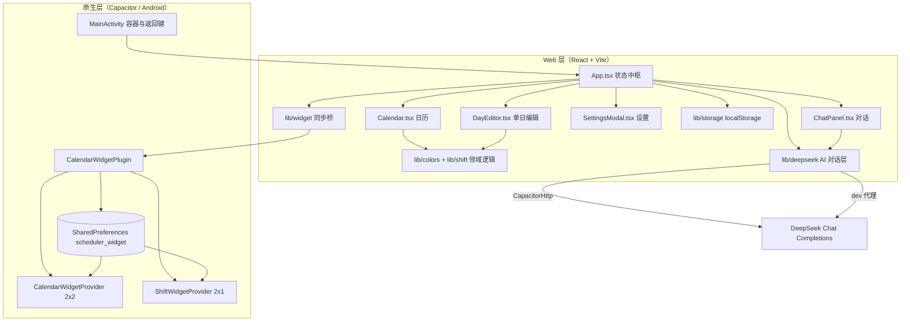
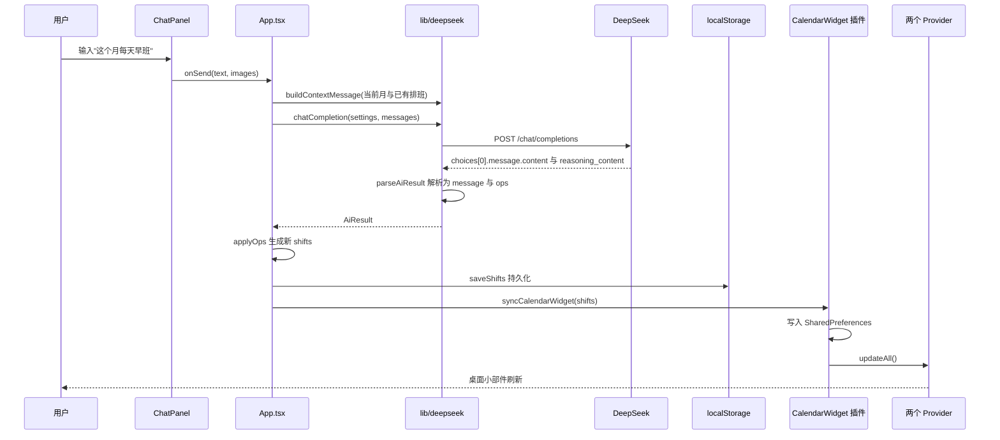

# 排班日历 系统架构

## 概述

排班日历（包名 `com.pbrili`）是一个面向轮班工作者的安卓排班应用。它把「日历」和「AI 对话」结合在一起：用户既可以手动在日历上点选日期增删班次，也可以用一句自然语言（例如「这个月每天早班」）让 AI 自动把班次排进日历。

应用的核心能力有三块：

1. **日历查看与手动编辑**：按周/月展示，支持左右滑动切月、下拉展开当日班次明细、点击日期编辑班次（时间班次与休息两类）。
2. **自然语言 AI 排班**：对话式交互，AI 把相对时间（「下周一」「1 号到 5 号」）换算成具体日期，输出结构化的排班操作并立即写入日历；支持发送排班表截图辅助识别。
3. **桌面小部件**：两个 Android AppWidget，一个 2×2 的「排班日历」网格，一个 2×1 的「今明班次」文本条，数据随应用内排班变化自动刷新。

架构上，这是一个「单页 Web 应用 + Capacitor 原生容器」的组合：全部 UI 与业务逻辑运行在 React/Vite 构建的 Web 层，通过 Capacitor 打包为原生 APK。Web 层负责日历渲染、手势、AI 对话、本地持久化；原生层只承担三件事——提供系统 WebView 容器、提供 `CalendarWidget` 插件把排班数据写入 `SharedPreferences` 并触发小部件刷新、以及覆写返回键行为。应用没有自建后端，所有数据保存在设备本地。

AI 能力通过外部 **DeepSeek Chat Completions** 接口实现。API Key 由用户在设置页输入，仅存本机 `localStorage`，请求在原生端走 `CapacitorHttp`，在浏览器开发环境走 Vite 代理，避免 CORS 问题。

关键架构特征：原生端不做任何排班计算，只做「数据落盘 + 小部件渲染」；小部件的数据契约是应用与桌面之间唯一的跨层协议，由 `CalendarWidget.save()` 写入的一段 JSON 承担。

## 技术栈

**语言与运行时**

- TypeScript 5.6（`strict`、`noUnusedLocals`）
- React 18.3（函数组件 + Hooks）
- Android System WebView（Web 层运行容器）
- Java 17（原生层，Android Gradle Plugin 编译）

**框架与库**

- Vite 5.4（开发服务器与生产构建）
- date-fns 3.6（日期计算）
- Capacitor 6.2（Web 到原生的桥接与打包）
- Android AppWidget（`RemoteViews`）原生小部件

**数据存储**

- 浏览器 `localStorage`：排班、设置、对话历史
- Android `SharedPreferences`（`scheduler_widget`）：小部件读取的排班快照

**基础设施**

- Android SDK Platform 34 / Build-Tools 34.0.0
- Gradle（Android 构建），`minSdkVersion 22`、`targetSdkVersion 34`
- `@capacitor/cli` 执行 `cap sync` 同步 Web 产物到原生工程

**外部服务**

- DeepSeek Chat Completions API（`https://api.deepseek.com/chat/completions`）

## 项目结构

```
ai-scheduler/
├── index.html                 # Vite 入口 HTML
├── vite.config.ts             # Vite 配置（端口 5173、dev 代理、allowedHosts）
├── capacitor.config.ts        # Capacitor 配置（appId、appName、webDir）
├── tsconfig.json              # TypeScript 配置
├── package.json               # 依赖与脚本
├── src/                       # Web 应用源码
│   ├── main.tsx               # React 挂载入口
│   ├── App.tsx                # 顶层状态与浮层编排
│   ├── styles.css             # 全局样式（设计系统）
│   ├── types.ts               # 领域类型与默认设置
│   ├── components/            # UI 组件
│   │   ├── Calendar.tsx       # 日历与手势
│   │   ├── ChatPanel.tsx      # AI 对话面板
│   │   ├── DayEditor.tsx      # 单日班次编辑弹层
│   │   ├── SettingsModal.tsx  # 设置弹层
│   │   └── TimeWheel.tsx      # 时/分滚轮
│   └── lib/                   # 领域与基础设施逻辑
│       ├── colors.ts          # 班次配色与时段判定
│       ├── shift.ts           # 默认时间与班次命名
│       ├── storage.ts         # localStorage 读写
│       ├── deepseek.ts        # AI 请求与 JSON 解析
│       ├── image.ts           # 图片压缩
│       └── widget.ts          # 小部件同步桥
├── public/                    # 静态资源（APK、下载页）
├── widget-preview/            # 小部件字体/背景预览站（开发辅助）
└── android/                   # Capacitor 生成的原生工程
    ├── variables.gradle       # SDK 版本等构建变量
    └── app/
        ├── build.gradle       # 应用 id 与 versionCode/versionName
        └── src/main/
            ├── AndroidManifest.xml
            ├── java/com/pbrili/
            │   ├── MainActivity.java          # 容器、状态栏、返回键
            │   ├── CalendarWidgetPlugin.java  # JS -> 原生数据桥
            │   ├── CalendarWidgetProvider.java# 2×2 日历小部件
            │   └── ShiftWidgetProvider.java   # 2×1 今明班次小部件
            └── res/
                ├── layout/    # 小部件布局
                ├── drawable/  # 小部件背景
                ├── font/      # 内置字体
                └── xml/       # appwidget-provider 定义
```

**入口点**

- `src/main.tsx`：挂载 `<App />`。
- `src/App.tsx`：持有排班/设置/对话/月份/浮层等全局状态，串起日历、对话与 AI 请求。
- `android/app/src/main/java/com/pbrili/MainActivity.java`：原生 Activity 入口，注册插件、设置状态栏、处理返回键。

## 子系统

### React 前端应用

**目的**：承载全部界面与交互。
**位置**：`src/`、`src/components/`
**关键文件**：`App.tsx`、`Calendar.tsx`、`ChatPanel.tsx`、`DayEditor.tsx`、`SettingsModal.tsx`、`TimeWheel.tsx`
**依赖**：`src/lib/` 的领域逻辑、date-fns、React
**被依赖**：无（顶层）

`App.tsx` 是状态中枢：`shifts`（排班）、`settings`（AI 设置）、`messages`（对话历史）来自本地存储；`month`、`selectedDay`、`chatOpen`、`settingsOpen` 控制展示。浮层通过 `overlayStack` 与浏览器历史配合，使返回键按后进先出关闭。

### 排班领域逻辑

**目的**：定义班次的颜色、时段归属、默认时间与命名规则。
**位置**：`src/lib/colors.ts`、`src/lib/shift.ts`
**关键文件**：`colorForShift`、`periodForTime`、`inferTimes`、`autoShiftName`
**依赖**：`src/types.ts`
**被依赖**：`Calendar.tsx`、`DayEditor.tsx`、`App.tsx`

`periodForTime` 把一组开始/结束时间按与四个时段区间（早 08:00-12:40、中 12:40-17:20、晚 17:20-22:00、夜 22:00-08:00）的重叠分钟数做归类，取重叠最长的时段。跨天时间会被拆成 `[start, 24:00]` 与 `[00:00, end]` 两段。原生小部件用 Java 复刻了同一套归类算法，保证 Web 与桌面配色一致。

### AI 对话层

**目的**：把自然语言转换为可执行的排班操作。
**位置**：`src/lib/deepseek.ts`
**关键文件**：`SYSTEM_PROMPT`、`chatCompletion`、`buildContextMessage`、`parseAiResult`
**依赖**：`@capacitor/core` 的 `CapacitorHttp`、`src/types.ts`
**被依赖**：`App.tsx`

`SYSTEM_PROMPT` 约束模型只输出一个 JSON 对象 `{ message, ops }`。`parseAiResult` 依次尝试：剥掉 Markdown 代码块、截取首个平衡的 JSON 对象、对不完整 JSON 做括号/引号补全，最后逐字段校验（日期必须匹配 `YYYY-MM-DD`）。解析失败时 `App.tsx` 会追加一条系统消息要求模型重发一次。

### Capacitor 原生桥

**目的**：把 Web 层排班数据交给原生层，并触发小部件刷新。
**位置**：`android/app/src/main/java/com/pbrili/CalendarWidgetPlugin.java`、`src/lib/widget.ts`
**关键文件**：`CalendarWidget` 插件（`save` / `getStatus`）
**依赖**：`CalendarWidgetProvider`、`ShiftWidgetProvider`
**被依赖**：`App.tsx`（通过 `syncCalendarWidget`）

`syncCalendarWidget` 在原生平台把 `DayShifts` 精简为 `{ name, start, end }` 列表并序列化成 JSON 字符串传入。插件写入 `SharedPreferences` 后，在主线程调用两个 Provider 的 `updateAll()`。

### Android 桌面小部件

**目的**：在桌面展示排班信息。
**位置**：`android/app/src/main/java/com/pbrili/CalendarWidgetProvider.java`、`ShiftWidgetProvider.java`
**关键文件**：`renderWidget`（日历）、`describe`（今明班次）、`periodColor` / `colorFor`
**依赖**：`SharedPreferences`、`RemoteViews`、平台 `Calendar`
**被依赖**：`CalendarWidgetPlugin`

日历小部件采用静态 6×7 网格布局（固定 id `w_cell_N` / `w_badge_N`），根据当月第一天星期几计算 42 格的起始日期，逐格填日期与「班/休」角标，并按行是否含本月日期切换整行可见性。今明班次小部件读取今天/明天的班次，拼成「今天 08:00-17:00」形式并按开始时间分色。

### 本地存储

**目的**：持久化用户数据。
**位置**：`src/lib/storage.ts`
**关键文件**：`loadShifts` / `saveShifts`、`loadSettings` / `saveSettings`、`loadChat` / `saveChat`
**依赖**：浏览器 `localStorage`
**被依赖**：`App.tsx`

排班、设置、对话分别使用独立键。`saveChat` 在写入失败（图片过大导致超出配额）时退化为只保留最近 20 条并去掉旧消息中的图片。

## 系统架构图



## AI 排班请求时序


