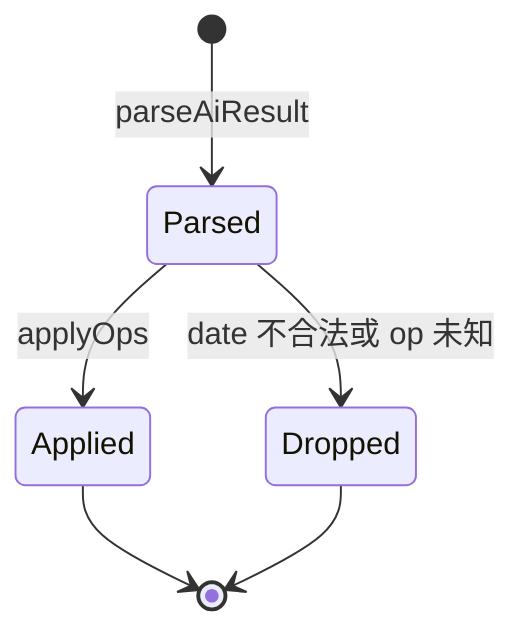
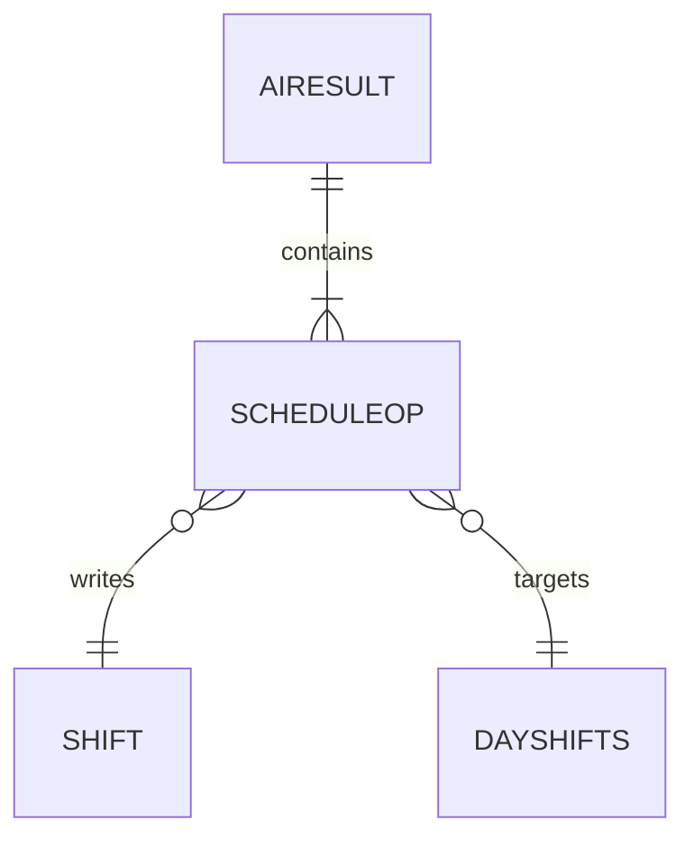

# 排班操作 ScheduleOp

排班操作是 AI 与应用之间的指令单位。AI 不直接返回「某月某日上什么班」的完整日历，而是返回一组对日历的最小操作，由应用负责执行并落到本地存储。

## 什么是排班操作

排班操作表示对某一天排班的原子修改，目前有两种：`set`（覆盖某天班次）与 `clear`（清空某天班次）。AI 一次回复会带一组操作，应用按顺序逐条应用。

**关键特征**

- 操作是「按天覆盖」语义，而非增量合并
- 日期必须是具体的 `YYYY-MM-DD`，相对时间由 AI 换算
- 范围描述（如「1 号到 5 号」）由 AI 展开成多条操作

## 代码位置

| 方面 | 位置 |
|------|------|
| 类型定义 | `src/types.ts` 的 `ScheduleOp` 与 `AiResult` |
| AI 协议与提示词 | `src/lib/deepseek.ts` |
| 解析与校验 | `src/lib/deepseek.ts` 的 `parseAiResult` |
| 执行 | `src/App.tsx` 的 `applyOps` |

## 结构

```ts
interface ScheduleOp {
  op: 'set' | 'clear'
  date: string
  shifts?: Array<{ name: string; start?: string; end?: string; color?: string }>
}

interface AiResult {
  message: string
  ops: ScheduleOp[]
}
```

### 关键字段

| 字段 | 类型 | 描述 | 约束 |
|------|------|------|------|
| `op` | `'set'` \| `'clear'` | 操作类型 | 其他值被忽略 |
| `date` | `string` | 目标日期 | 必须匹配 `^\d{4}-\d{2}-\d{2}$` |
| `shifts` | `array?` | `set` 时的班次列表 | `clear` 时忽略 |

## 执行语义

`applyOps` 在 `App.tsx` 中执行：

- `clear`：从 `DayShifts` 中删除该日期键。
- `set`：用新数组替换该日期原有班次。每个班次先取用户或 AI 给定的时间；未给时间则调用 `inferTimes(name)` 补默认时间；随后生成新 `id`，并用 `colorForShift` 重新计算 `color`。

由于是覆盖语义，AI 提示词明确要求：只改某天其中一个班次时，要把该天其它班次一并写进 `set`，避免丢失。

## 不变量

1. **日期必须具体**：无法匹配 `YYYY-MM-DD` 的操作被丢弃，不会报错中断整批。
2. **set 覆盖同一天**：同一天多条 `set` 以最后一条为准。
3. **操作按序执行**：`ops` 数组按顺序作用于同一份 `DayShifts`。

## 生命周期



## 关系



| 关联概念 | 关系 | 描述 |
|---------|------|------|
| 班次 Shift | 写入 | `set` 用操作中的 shifts 生成班次 |
| AiResult | 属于 | 每个结果包含一组操作与一句回复 |
