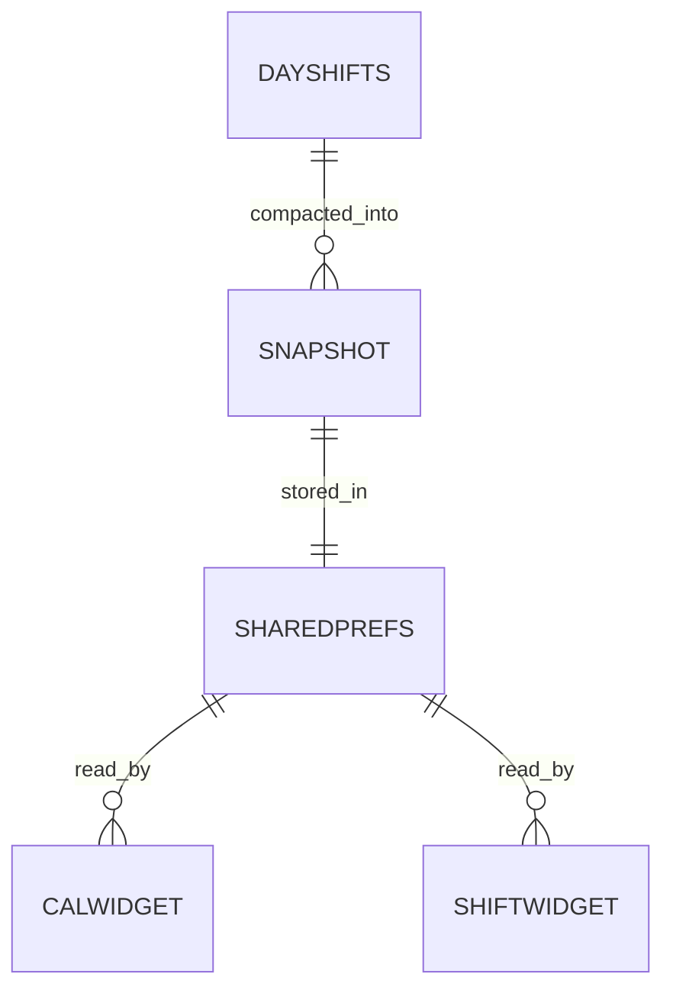

# 桌面小部件数据

桌面小部件数据是 Web 层与原生层之间唯一的跨层协议。应用把排班精简成一段 JSON 写入原生存储，两个 AppWidget 各自解析并渲染，从而在应用之外展示排班。

## 什么是桌面小部件数据

它是一份由 `CalendarWidget.save()` 写入 `SharedPreferences` 的排班快照。原生端不参与排班计算，只把这份快照翻译成桌面可见的视图。

**关键特征**

- 单向流动：应用写，小部件读
- 精简结构：只保留小部件渲染需要的 `name`、`start`、`end`
- 主动触发刷新：写入后由插件调用两个 Provider 的 `updateAll()`

## 代码位置

| 方面 | 位置 |
|------|------|
| 生成与发送 | `src/lib/widget.ts` 的 `syncCalendarWidget` |
| 接收与落盘 | `CalendarWidgetPlugin.java` |
| 读取与渲染（日历） | `CalendarWidgetProvider.java` |
| 读取与渲染（今明） | `ShiftWidgetProvider.java` |
| 存储 | `SharedPreferences` 文件 `scheduler_widget` |

## 结构

Web 层发送的 `data` 是如下 JSON 的字符串：

```json
{
  "shifts": {
    "2026-09-01": [
      { "name": "早班", "start": "08:00", "end": "17:00" }
    ],
    "2026-09-05": [
      { "name": "休息" }
    ]
  }
}
```

### 关键字段

| 字段 | 类型 | 描述 | 约束 |
|------|------|------|------|
| `shifts` | object | 日期到班次数组的映射 | 键为 `yyyy-MM-dd` |
| `shifts[date][].name` | string | 班次名称 | 休息类班次无时间时展示名称 |
| `shifts[date][].start` | string? | 开始时间 | `HH:mm` |
| `shifts[date][].end` | string? | 结束时间 | `HH:mm` |

## 渲染规则

### 排班日历（2×2）

- 标题显示当前年月；星期行为静态文本。
- 网格为固定 6 行 × 7 列，共 42 个单元格，从当月起止周补齐。
- 本月日期用深色，非本月日期用浅灰。
- 有排班的日期在数字下方显示角标：时间班次为「班」，纯休息为「休」；无排班留空。
- 整行若不含任何本月日期则隐藏该行。

### 今明班次（2×1）

- 两行分别显示今天与明天。
- 文案形如「今天 08:00-17:00」；无排班显示「今天 无排班」；休息显示班次名称。
- 按开始时间分色：早于 12:00 橙色、早于 16:00 绿色、早于 21:00 紫色、其余深色；无法判定用灰色。

## 不变量

1. **总数据源唯一**：排班变化只在 `App.tsx` 的 `useEffect` 中触发同步，小部件不独立存储业务数据。
2. **原生不做计算**：小部件只做「读 JSON + 格式化 + 上色」，时段归类算法是 `src/lib/colors.ts` 的复刻，不引入新规则。
3. **刷新由写入驱动**：除 30 分钟的 `updatePeriodMillis` 兜底外，刷新只在 `save` 成功后发生。

## 关系



| 关联概念 | 关系 | 描述 |
|---------|------|------|
| 班次 Shift | 来源于 | 快照由班次精简而来 |
| Capacitor 插件 | 通过 | `CalendarWidget.save` 是唯一写入入口 |
