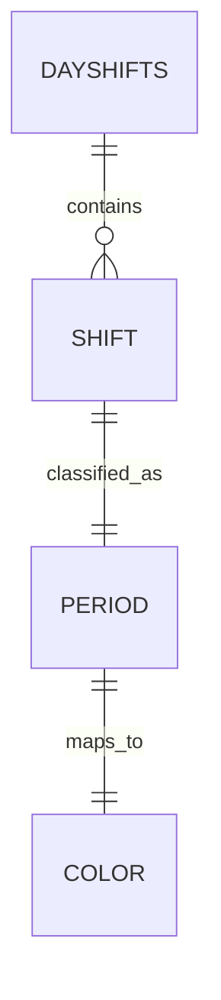

# 班次 Shift

班次是排班的最小单位，代表某一天的一项工作安排或休息。它是整个应用的领域核心：日历渲染、AI 排班、颜色与时段判定、小部件展示都围绕班次展开。

## 什么是班次

一个班次属于某一天，可以带一段时间区间（时间班次），也可以不带（如「休息」）。时间班次由开始与结束时间决定它的时段归属和颜色。

**关键特征**

- 按日期分组存放，同一天可以有多个班次
- 有开始/结束时间为时间班次；无时间则为休息类班次
- 颜色由时段（早/中/晚/夜）推导，而非用户手动选择

## 代码位置

| 方面 | 位置 |
|------|------|
| 类型定义 | `src/types.ts` 的 `Shift` 与 `DayShifts` |
| 时段与颜色 | `src/lib/colors.ts` |
| 默认时间与命名 | `src/lib/shift.ts` |
| 持久化 | `src/lib/storage.ts` |
| 日历展示 | `src/components/Calendar.tsx` |
| 手动编辑 | `src/components/DayEditor.tsx` |
| 小部件展示 | `CalendarWidgetProvider.java` / `ShiftWidgetProvider.java` |

## 结构

```ts
interface Shift {
  id: string        // 随机生成的本地标识
  name: string      // 名称，如「早班」「休息」
  start?: string    // 开始时间 "HH:mm"，可省略
  end?: string      // 结束时间 "HH:mm"，可省略
  color?: string    // 前景色，由 colorForShift 计算
}

interface DayShifts {
  [date: string]: Shift[]   // 键为 "yyyy-MM-dd"
}
```

### 关键字段

| 字段 | 类型 | 描述 | 约束 |
|------|------|------|------|
| `id` | `string` | 本地唯一标识 | 由 `Math.random().toString(36).slice(2, 10)` 生成 |
| `name` | `string` | 班次名称 | 空值在解析 AI 结果时回退为「班次」 |
| `start` | `string?` | 开始时间 | 24 小时制 `HH:mm` |
| `end` | `string?` | 结束时间 | 24 小时制 `HH:mm`；与 `start` 同时存在才算时间班次 |
| `color` | `string?` | 前景色 | 由 `colorForShift(...).fg` 赋值 |

## 时段与颜色

时间班次按与四个固定区间重叠的分钟数归类，取重叠最长的时段。跨天的时间（如夜班 `22:00-08:00`）会拆成 `[22:00, 24:00]` 与 `[00:00, 08:00]` 两段参与计算。

| 时段 | 区间 | 颜色 |
|------|------|------|
| 早 | 08:00 - 12:40 | `#FDF6EC` / `#E6A23C` |
| 中 | 12:40 - 17:20 | `#E6F7F2` / `#1ABC9C` |
| 晚 | 17:20 - 22:00 | `#F0EAFE` / `#8E44AD` |
| 夜 | 22:00 - 08:00 | `#D5DBEB` / `#2C3E50` |

非时间班次（休息类）回退到按名称匹配：`休息` 用灰色，`上班`/`白班` 用工作蓝，其余名称按名称哈希落到调色板。

## 默认时间

`src/lib/shift.ts` 的 `DEFAULT_TIMES` 为常见名称提供默认时间，AI 与手动编辑在用户未指定时间时使用：

| 名称 | 时间 |
|------|------|
| 早班 | 08:00 - 12:40 |
| 中班 | 12:40 - 17:20 |
| 晚班 | 17:20 - 22:00 |
| 夜班 | 22:00 - 08:00 |
| 白班 | 08:00 - 18:00 |
| A班 | 08:00 - 12:40 |
| B班 | 12:40 - 17:20 |
| C班 | 22:00 - 08:00 |

## 不变量

1. **时间成对出现**：只有 `start` 与 `end` 同时存在时，班次才被视为时间班次并参与时段计算；只有其一时按无时间处理。
2. **颜色可重算**：`color` 只是缓存字段，任何时候都可以由 `name` 与时间重新推导，不参与业务判断。
3. **同日数组可含多项**：一天可以有多个班次，日历最多显示前 3 个时间班次，超出以 `+N` 提示。

## 关系



| 关联概念 | 关系 | 描述 |
|---------|------|------|
| 排班操作 ScheduleOp | 被修改 | `set` 覆盖某天班次，`clear` 清空某天班次 |
| 桌面小部件数据 | 被序列化 | 班次精简为 `{ name, start, end }` 后写入小部件 |
